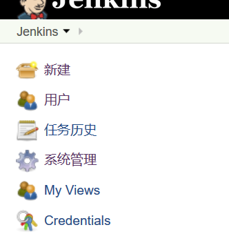
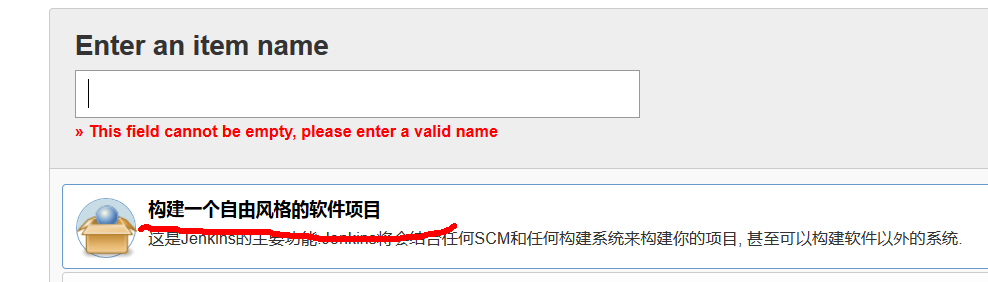
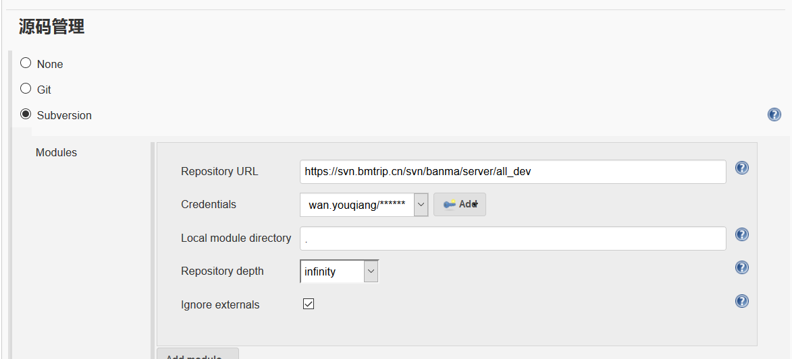
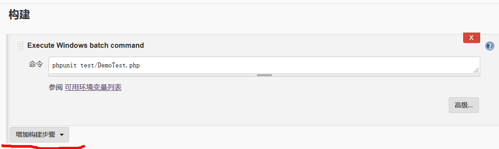
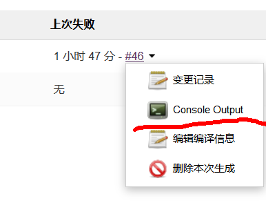
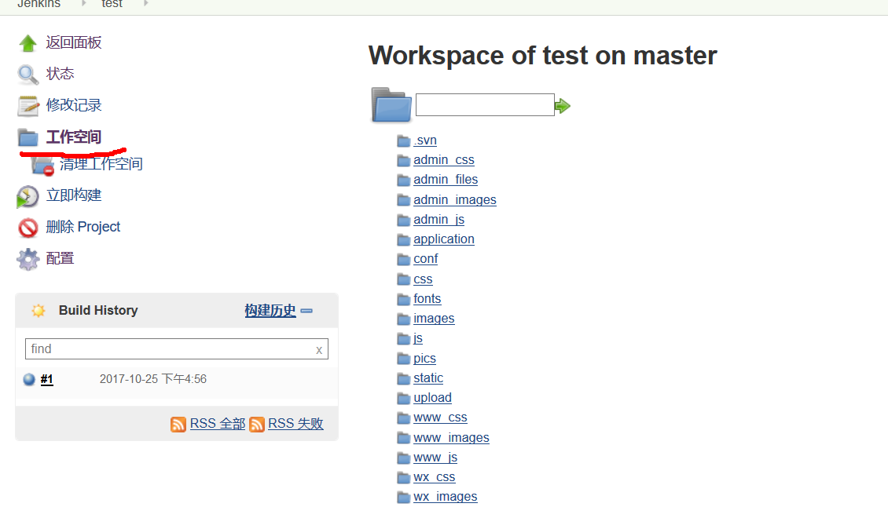
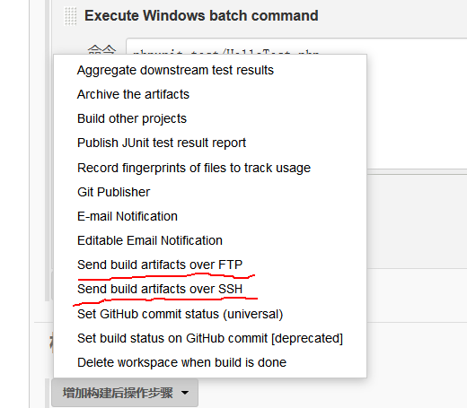
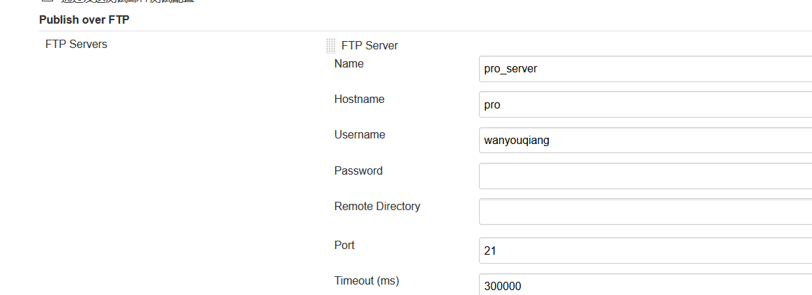
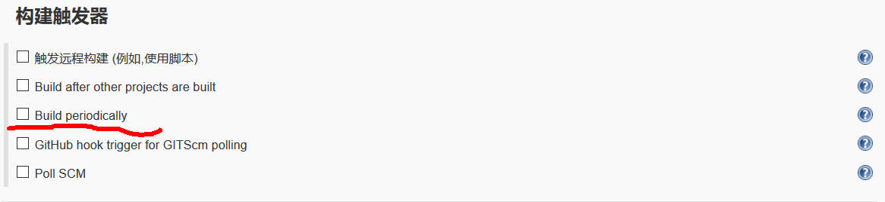

# Jenkins自动化持续集成系统环境搭建

> Jenkins是用Java开发的一款开源自动化持续集成工具， 主要用于监控持续重复的工作，提供一个开放易用的软件开台。

### Jenkins安装
* 安装JRE/JDK,配置Java可执行路径
* 下载Jenkins的war包(https://jenkins.io/)
* 执行安装#java -jar jenkins.war#
* jenkins自带服务器(localhost:8080)，也可以另外使用tomcat服务器

### phpunit与ping的安装
* 分别下载phpunit(PHP单元测试工具)ping(PHP自动构建工具)，并配置可执行命令

### 安装插件
* 常用插件(GIT、SVN、PHPCS、Phing、Clover PHP、FTP)
* 安装Phing(必须)，用于进行PHP代码的构建
* 配置build.xml文件

    `
        <project name="banma" default="build">
            <target name="build" depends="phpunit,test"/>
            <target name="phpunit" description="Run unit tests with PHPUnit">
                <exec executable="phpunit" />
            </target>
            <target name="test" description="Run PHPUnit tests">
                <phpunit haltonerror="true" haltonfailure="true" printsummary="true" pharlocation="D:\wamp64\bin\php\php7.1.9\phpunit-5.7.2.phar">
                    <batchtest>
                        <fileset dir="tests">
                            <include name="**/*Test.php" />
                        </fileset>
                    </batchtest>
                </phpunit>
            </target>
        </project>
    `

### 创建持续集成项目

### 配置SVN(自动更新、自动下载)

### 配置自动构建(需要提前写好测试脚本，全自动测试，定时测试)

### 查询信息

### 工作区(workspace)

### 自动化部署(publish over ssh/publish over ftp)

### Jenkins定时构建（Build periodically）

* 定时构建语法
    `
        * * * * *
        
        第一个*表示分钟，取值0~59
        第二个*表示小时，取值0~23
        第三个*表示一个月的第几天，取值1~31
        第四个*表示第几月，取值1~12
        第五个*表示一周中的第几天，取值0~7，其中0和7代表的都是周日
        
        H/5 * * * * --第隔5分钟构建一次
        H H/2 * * * --每两小时构建一次
        0 18 * * * --每天下午下班前定时构建一次

    `